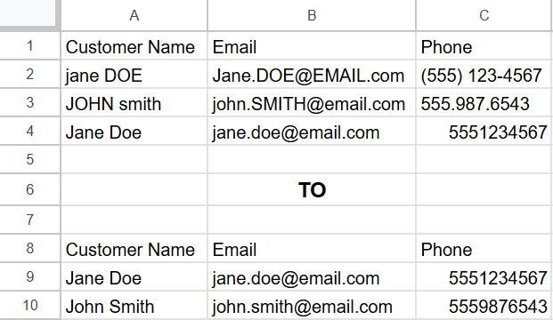

# 📋 CRM Cleanup Script

Transforms messy customer lists into clean, CRM-ready data.

## ✅ Features

- Title-case names and cities
- Lowercase all emails
- Normalize phone numbers
- Remove duplicates

## ▶️ How to Run

```bash
python crm_cleaner.py
```

## 📁 Files

- raw_clients.csv
- crm_cleaner.py
- cleaned_clients.csv
- example.png (before/after visual)

## 📸 Preview

